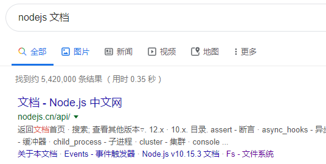
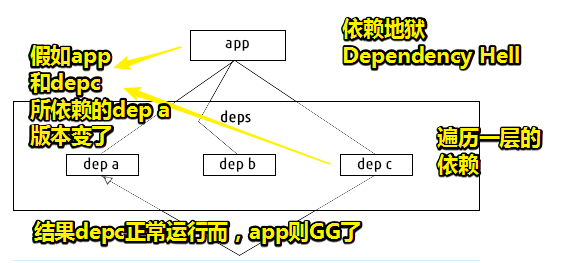

# nodejs入门

## ★资源

> [Node.js 入门 - 写代码啦！](https://xiedaimala.com/tasks/b4070240-c8e9-4eee-9207-b8ddf330c402)

## ★课程简介

1. fs 模块
2. http 模块
3. express 框架
4. koa 框架
5. Event Loop

## ★Event Loop（文章）

> 这是篇很重要的文章：[Event Loop、计时器、nextTick - 掘金](https://juejin.im/post/5ab7677f6fb9a028d56711d0)

### ◇几张图


---


---


---

### ◇MacroTask 和 MicroTask

妈（Ma）咪 （Mi）

- macrotasks 有 setTimeout setInterval setImmediate I/O UI渲染
- microtasks 有 Promise process.nextTick Object.observe MutationObserver

1. 先执行 Ma 再执行 Mi。
2. new Promise(fn).then(success) 期中 fn 是立即执行的，success 会被放入 Mi 任务。

面试题：

```js
console.log('script start');

setTimeout(function() {
  console.log('setTimeout');
}, 0);

let promise = new Promise((resolve, reject)=>{
    console.log(1)
    resolve()
})
promise.then(function() {
  console.log('promise1');
}).then(function() {
  console.log('promise2');
});
```

请说出 log 的顺序。

答案自己运行一下就知道了。

---

## ★CRM法入门Node.js

### ◇概述

关于nodejs的学习，如果你是做前端的，那么3年以内其实你是不需要学的，如果要学也是为面试准备的，就像是高考满分150分的数学卷，总有20分是留给尖子生的！而在这里，面试时，涉及nodejs的考题也是类似于这20分，总之，你会nodejs，那么就是你面试前端的加分项！

> 之前学得Web性能优化，你得实践后才知晓，刚开始靠死记硬背是不可能学会的，所以那些刚从饥人谷毕业的学生想去面试阿里社招的，请打消这个念头！因为你得工作两年以上才去考虑！没有经验基本就是凉凉了，就算你是天才也不要你！

话又说回来，nodejs入门讲什么呢？——有以下这么几个东西：

1. fs 模块
2. http 模块
3. express 框架
4. koa 框架
5. Event Loop

主要就是讲两个本地模块、两个框架，以及最重要的Event Loop

> 前面4个内容半小时讲完，最后这个内容需要半小时讲解！

### ◇ fs 模块

我们之前学过一个套路，叫CRM套路！请记住，这个套路是芳芳学东西的唯一套路！即 copy run modify

接下来，你无须理会 fs 模块到底是什么，你需要知道的是芳芳是如何学习这个知识点的，如看了啥网站？看了啥文档？抄了啥代码？即可！

#### 怎么学？

1. 搜索nodejs官方文档，英文和中文都行

   

   > 加「文档」二字定位到中文版的文档， 不加就是英文的！

2. 找到有关fs的内容，可见它是文件系统模块！可以用于读写文件

   

3. fs模块旗下有很多API，你可以一个个看，也可以挑取几个你感兴趣的API来看！

   

4. 

5. 点进去，直接看例子，抄代码，不要看文字描述！

   ```js
   fs.readFile('/etc/passwd', (err, data) => {
     if (err) throw err;
     console.log(data);
   });
   ```

   有JavaScript的基础，自己可以根据代码简单分析一下这例子需要怎样的输入，如需要一个路径，一个callback。进一步分析callback，readFile是个异步API，如果读取资源error，那么就会报错，否则就把资源的data给log出来！

6. 测试代码。找个合适的位置，创建node-demo这个目录，然后创建个test.js，直接把例子代码拷贝进去，啥也不需要管！然后运行：

   

7. 报错了说fs没定义，既然如此那就回去看该API的文档呗！然而文档没有写，没有告诉我们如何得到fs，可见这文档很贱啊！其实，文档有说，当然，这不是在某个API里边说的，而是一开始就说了：

   **➹：**[fs - Node.js API 文档](http://nodejs.cn/api/fs.html#fs_file_system)

   如果你找不到答案，那么你只能谷歌或问人了。

8. 解决bug：

   

   这句代码表示「它会去node里边去加载这个fs模块，而这个模块就是个对象」

   代码运行了，还是报错了，说咩有这样的文件或目录，既然如此，那我们就搞个有的呗！

   

   > 路径不要写 `~/desktop/`这样的，波浪线只对bash有用！所以你不能写波浪线哈！
   >
   > 
   >
   > 不分盘的除外！

9. 拿到的data到底是什么？Buffer？LOL里边的蓝buffer、红buffer？

   那么这时就得回去看文档了。

   看文档知晓：

   > 回调会传入两个参数 `(err, data)`，其中 `data` 是文件的内容。
   >
   > 如果没有指定 `encoding`，则返回原始的 buffer。
   >
   > 如果 `options` 是字符串，则它指定字符编码：
   >
   > ```js
   > fs.readFile('/etc/passwd', 'utf8', callback);
   > ```

   所以可有：

   

   而此时的err值是null，当然如果你不用`utf8`参数也可以把data的值变成真正的字符串，直接 `data.toString()`即可！就像这样：

   

   至此这个 `fs.readFile()`API你也就学会了！

同理 `fs.readFileSync()`这个API也是这样学，直接CRM大法即可！

不过它跟异步的读还是有区别的！区别在于它没有callback，你要拿到data，直接拿到这个API的返回结果即可！如果咩有找到资源那么就会报错！当然这同样是边解析边执行的！

```js
const xxx = fs.readFileSync('../staic/test.txt');
console.log('readFileSync先执行！')
console.log(xxx.toString())
```

总之，它是同步的API，不需要callback。读完之后就会把读到的buffer给xxx。与异步的读，形式上写法不一样。

至此，两个API也就学会了！然后就去用即可！

[demo](./node-demo/01/01-test-fs.js)

接下来，就是学习fs的各类API，用CRM大法即可！

如：

1. 访问文件的路径
2. 往文件里边添加内容
3. 改变文件的执行权限
4. 改变文件拥有者
5. 复制文件
6. 判断一个文件存不存在
7. 获取文件信息
8. ……

总之，你要做的事，就是把文档看完，然后你的nodejs也就入门了

所以说这所谓的入门。其实就是看你有没有熟悉这些API

像JavaScript一样，对于nodejs来说，你已经学会了JavaScript，那么剩下的**你要学的只有API**了

### ◇ http 模块

这个模块干嘛的呢？——还记得之前用nodejs写的http服务吗？

那么如何用nodejs写一个提供http服务的程序？

1. 你得有一个server（看文档）
2. 有了server，那就创建一个server实例呗！
3. 实例有了，那就监听
4. 然而还是不会写，[Using node.js as a simple web server - Stack Overflow](https://stackoverflow.com/questions/6084360/using-node-js-as-a-simple-web-server/13635318)

简单的http server：

```js
var http = require('http');
var fs = require('fs');
var index = fs.readFileSync('index.html');

http.createServer(function (req, res) {
  // 如果是 'text/plain'拿到的是咩有解析HTML的字符串源码了
  // res.writeHead(200, {'Content-Type': 'text/plain'});
  res.writeHead(200, {'Content-Type': 'text/html'});
  res.end(index);
}).listen(9999);

// log提示该server正在运行，不然咩有提示的话，用户可是不知道server正在跑
console.log('正在监听9999端口……')
```

完善：

1. index.html内容修改了，刷新页面不会跟着修改
2. ……

当然，你要完善它的话，你可以通过log一下req和res，看看都传了什么实参过来！

其实，上边的例子，不是很纯粹，不利于学习，毕竟引入了其它不明所以的API，所以，我们只需要弄个「壳」即可：

```js
var http = require('http');

let server = http.createServer(function (req, res) {

})

server.listen(9999);
console.log('正在监听9999端口……')
```

> <http://nodejs.cn/api/http.html#http_class_http_clientrequest>

接下来往壳里边填充东西：

1. 通过request，获取路径：

   于是，查找了有关http的req[官方文档](http://nodejs.cn/api/http.html)

   结果。没找到，所以我只好求助Stack Overflow了：「nodejs request path stackoverflow」

   **➹：**[javascript - Node.js: get path from the request - Stack Overflow](https://stackoverflow.com/questions/18931452/node-js-get-path-from-the-request/18931706)

   可以看到最高赞的答案：

   

2. 根据拿到的路径发出响应：

   这次不用看文档了，直接搜索Stack Overflow即可！

   由于搜索关键字的缘故，大都是与express相关的内容，于是你可以在搜索关键字后边加个 `-express`，那么就会搜索到有与express相关的内容了

   或许是英文的缘故，我还是用中文关键字好了，看人家博客方便得多：

   **➹：**[Node.js http模块 设置响应头 - jimjiayu - CSDN博客](https://blog.csdn.net/zhongshijun521/article/details/60139013)

   **看了这些例子之后，你就去看官网看看那些你没有用过的API，如果该API没有例子的话，你可以这样：**

   如 `response.write`这个API，毕竟这肯定有人不知道用，然后就问出来了，而问了肯定就有人回答：「nodejs response.write stackoverflow」

   

   **➹：**[node.js - Node Js problems with response.write - Stack Overflow](https://stackoverflow.com/questions/6068820/node-js-problems-with-response-write)

   可有：

   

   可见，需要设置响应状态码、响应头（可选）、响应体（可选）、响应结束（不写页面一直转）

   所以，目前代码如下：

   ```js
   var http = require('http');
   
   let server = http.createServer(function (req, res) {
     console.log(req.url) //http://localhost:9999/fuck，该值为/fuck
     res.statusCode = '201'
     res.write('hello')
     res.end()
   })
   
   server.listen(9999);
   console.log('正在监听9999端口……')
   ```

   测试效果：

   

### ◇小结

以上就是nodejs的学习方法了，即不停地抄代码，然后运行理解，如此循环；还有就是如果文档上咩有关于xxx API的使用例子，那就去Stack Overflow上抄！

总之，以上这两个模块基本上就靠这个学习方法了。没有什么特殊技巧，你只要不停地去试这个API怎么用就行了！就好像你平时在写JavaScript那样，如DOM API，怎么获取爸爸，怎么获取儿子，怎么添加儿子，怎么删除儿子等等……

### ◇一个重要的心理障碍知识


你总在期待芳芳能不能讲一下，小程序、react、angular、nodejs、koa等知识

你觉得自己看文档学不会，所以根本就不会去看。至此，你有了这样的需求——等着芳芳教我

然而在程序界里边有这么一种说法「**做程序员的话，如果你等着别人去教你一些新技术的话，那么你会死的，即很快就会被这个行业所淘汰！**」

其实，对于所有的新技术学习，你都按照芳芳的那个套路（CRM）来学习即可！没要啥知识，只需要不停地踩坑就完了！你坑踩得越多，你就越厉害！当你把所有坑踩完了，那么你就是大师了，就像是张鑫旭大佬学习CSS那样！

回过头来，什么叫小程序的程序员呢？——**就是哪里会出bug，你全部都踩过了！那么你就无敌了！显然，这就会有人要你了！**

或许你又会说「我没有看文档，你直接告诉我怎么写，这不就完了吗？这可谓省时省力啊！」

这可不可能啊！因为你不踩坑的话，那你学到的只是一种写法啊！一种场景需求啊！而老师不可能把每一种场景需求、每一种写法都面面俱到的讲给了听啊！这可不是一日为师，终生为师啊！

> 我的学习姿势是，了解了基本的语法知识以及相关的基础API知识和核心知识（如nodejs的event loop）之后，直接就开始撸项目了！通过做一个完整得项目来学习那些API之类的！
>
> 这篇博客写完之后，我就开始撸nodejs项目了。如果有现成的项目文档教程得话，我会先看项目文档，然后再去看一些项目教学视频！

总之，**程序员的大部分时间就是把坑踩一下，然后以后避免就行了！**

## ★学习两个框架

> Koa和Express

### ◇Express

Express怎么用呢？其实根据之前所学的知识，已经学过了呀，只不过没有看文档而已！

那么这该怎么学呢？

同样地，去搜索一下中文文档即可！

<https://expressjs.com/zh-cn/>

> 请注意域名

由于中文文档可能已经过时了，所以就去看英文文档：

<https://expressjs.com/>

使用：

1. 安装：

   ```bash
   mkdir express-demo
   cd express-demo
   # 为应用程序创建 package.json 文件，默认，一直回车即可！
   npm init
   # 保存在依赖项列表里边的，--save参数表示将该模块写入dependencies属性
   npm install express --save
   # 要临时安装Express而不将其添加到依赖关系列表中，请执行以下操作:
   npm install express --no-save
   ```

   目前有哪些文件和目录：

   

2. 使用例子——写个[hello world](https://expressjs.com/en/starter/hello-world.html)：

   创建个server.js文件，然后把下边代码拷贝进去，直接运行，运行成功后，理解一下代码，然后修改一下代码再运行一遍呗！

   > 注意别抄错代码了，不然没有预期的效果，就会怀疑文档是不是写得很烂？或者认为自己根本就看不懂文档？

   ```js
   const express = require('express')
   const app = express()
   const port = 3000
   
   app.get('/', (req, res) => res.send('Hello World!'))
   
   app.listen(port, () => console.log(`Example app listening on port ${port}!`))
   ```

   

   运行效果：

   

   还有状态码也不用设置了！

   > 我稍微看了一下express.js这个模块：
   >
   > 
   >
   > 感觉这个框架用了各种设计模式来组织代码！讲真，我是真得不懂怎么看这些源码！我只知道，一般都是先看init这个方法的！然后根据这个init顺藤摸瓜去看！
   >
   > 

至此，你把一个Hello world跑通之后，那也就意味着你把所有的知识都学过了！而且你也无须继续看文档了！

接下来请根据的疑问，不断地完善代码：

1. 我想特定的路径，输出特定的内容，而不是默认不管写啥路径都是返回 `Hello World!`

   ```js
   app.get('/xxx', (req, res) => res.send('我是/xxx'))
   ```

2. 我想返回的是一个文件，而不是自己send一个数据响应回去（express send flie（or文件） ）

   > [node.js - res.sendFile absolute path - Stack Overflow](https://stackoverflow.com/questions/25463423/res-sendfile-absolute-path)
   >
   > 目前，我们所做的一切其实都是在拧螺丝，而你真得不用去想其它的东西，因为原理你都知道了！而你要做的就是把你熟练度给提升起来！

   ```js
   res.sendFile('public/index.html');
   ```

   直接拷贝代码，有可能会出错，但这没有关系呀！随便写，根据报错信息，改代码不就完事了吗？

   代码直接运行，结果还真是报错了，报错信息如下：

   

   > 本来以为是说找不到这个index.html，没想到是这个报错信息呀！

   可见，nodejs不支持相对路径，但是，nodejs提供了相应的模块path，可以让你支持「相对路径」！

   ```js
   const path = require('path')
   app.get('/', (req, res) => {
     // 当前路径与相对路径拼接，变成合理的路径
     console.log(__dirname)
     let p = path.join(__dirname,'./index.html')
     console.log(p)
     res.sendFile(p);
   })
   ```

   

   此时，报错信息就不一样了，说是找不到资源哈！

   所以，我们需要创建个index.html

   最终结果：

   

   > 后端路由根据不同的url拿到了不同的资源！

   3. 不想每个路由都得自己写，能不能少写点路由，就能访问其它静态资源？

      1. `app.use('/static', express.static(__dirname + '/public'));`：这一步起到加个路由的作用！而且效果类似于一对多，或者说是动态拼接路由！减少了某个目录下的路由书写次数，如访问public目录下的文件，无须一个资源文件对应一个路由这样写了！

      2. 在项目的根目录下创建一个public目录：

         

      3. 测试（并没有写这样 `app.get('/static/css/1.css', (req, res)=>{})`这样的路由）：

         

         可见访问 `/static`，就会自动访问 `public/`下的资源，即 `/static`等价于绝对路径的 `public/`

         > 从这也可以看出url不一定等价于资源在本地的路径，这一切都得看开发者如何写这个路由的

      **➹：**[在 Express 中提供静态文件](https://expressjs.com/zh-cn/starter/static-files.html)

   4. 我想让index.html，即首页更完善一点，如引入css和JavaScript文件：
      改一下资源映射：`app.use('/public', express.static(__dirname + '/public'));`

      这样一来 ，url访问时的`/public`就和 本地的 `public`目录一一对应了！而且使用了Express框架之后，服务端修改静态资源，一刷新页面就会更新显示，无须重启服务器！而且，我们访问这些资源，这个Express框架都会帮预设了默认的响应头，如搞了缓存，告诉浏览器每个静态资源都是什么类型的文件，至此浏览器就会知道用什么姿势去解析这些资源了。

      至此，一个完整的首页就已经写好了！

   5. 我想把写的页面部署到网上：

      **➹：**[Cloud Application Platform - Heroku](https://www.heroku.com/)

      这个网站可以帮你做到，当然，这需要翻墙哈！

      那么如何部署呢？这很简单，请看下文

   6. 我想……

### ◇Koa

koa的作者和Express的作者是同一个人

那么这怎么用呢？——同样是抄！

> 所有框架就一个字「抄」，就跟我们学Vue一样「抄」

用法（写个hello world）：

1. 到官方文档找到「起步」：[Koa - node.js的下一代Web框架](https://koajs.com/)

2. 创建koa-demo/

3. 安装koa `npm i koa`

4. 创建server.js，添加以下代码：

   ```js
   const Koa = require('koa');
   const app = new Koa();
   
   app.use(async ctx => {
     ctx.body = 'Hello World';
   });
   
   app.listen(9998);
   ```

5. 运行： `node server.js`

6. 测试效果：

   

接下来干嘛？——继续看文档呀！

那么接下来，你就会知道：

1. 如何设置响应头？body？
2. listener是啥意思？
3. 如何是https？
4. app.keys是意思？
5. 如何处理错误？
6. ……

就这样直接看下去即可！

话说回来，如何返回个index.html？

这很简单，直接搜索即可！同express那样搜索，如express是 「express send file」，那么koa就是「koa send file」

总之就是把之前学习express的过程所用到的所有搜索关键字，把「express」改为「koa」即可！所以说，这些东西还是得你自己去看啊！总不能同样一个过程，因为是两个框架，所以得讲两遍吧！

搜索得知，找到一个插件文档，直接看这个文档怎么用，即不停地抄它的例子代码，跑通之后，就按照自己的需求去改：

**➹：**[koajs/send: Transfer static files](https://github.com/koajs/send)

1. 安装：`npm install koa-send`

2. 拷贝例子代码（全部都抄它的，自己一行代码都不写）：

   ```js
   const send = require('koa-send');
   const Koa = require('koa');
   const app = new Koa();
   
   // $ GET /package.json
   // $ GET /
   //如果路径是 / 则返回'Try GET /package.json'，如果路径不是 /，则根据路径返回相应的内容！
   app.use(async (ctx) => {
     if ('/' == ctx.path) return ctx.body = 'Try GET /package.json';
     await send(ctx, ctx.path);
   })
   
   app.listen(3000);
   console.log('listening on port 3000');
   ```

3. 测试：

   

   再次测试：

   

   > 可以看到这个插件自动的配置了绝对路径哈！可以根据url，返回相应的文件资源！不用像express那样，需要写个路径的资源映射！

可见，自己去看文档有多么的重要！苦口婆心的劝说你去看文档，真是心累啊！

### ◇小结

1. 如果你了解http，学习这些东西没啥问题

2. 简单的需求，如写个index.html，直接CRM。而复杂的需求（如做个留言板之类的、数据库怎么连接呢？），我们该怎么做呢？——同样是**搜索大法（Stack Overflow）+CRM大法**

   代码都有现成的，不要以为每个程序员都得根据需求自己想代码来写啊！这种认识是错误的呀！程序员从来不自己写代码，都是抄别人代码的！

   所以说为啥程序员崇尚开源呢？——就是因为有些人把代码写得好好的，给你抄呀！即意思就是给你抄，给你用呀！

3. 目前讲了两个模块fs（读写文件）和http（可以创建server），基于这个http模块，我们有两个框架express和koa，express就跟jQuery和dom api的关系一样，即可以让http模块更好用！koa则是把express重写了一遍！

   所以说，nodejs入门就是把fs、http、express、koa搞清楚即可！

4. 由于我们是前端，所以咩有必要说要深入学习nodejs，当然，想玩一玩也是可以的；当面试官问你有关nodejs的知识时，你说写过hello world！就可以了！

5. 所有demo： [demo](https://github.com/ppambler/nodejs-learn-2019/tree/master/01-%E5%85%A5%E9%97%A8/node-demo/01)

## ★ 把nodejs应用部署到HeroKu上

> 我们想把自己写的express代码放到服务器上，而且我想要免费的！
>
> Heroku就可以免费地帮我们弄个nodejs server，学习这个工具的使用就像使用hexo搭建博客一样的，所以自己去看文档和博客即可！
>
> **➹：**[Getting Started on Heroku with Node.js - Heroku Dev Center](https://devcenter.heroku.com/articles/getting-started-with-nodejs)

1. 注册

2. 本地已经安装了npm和nodejs

3. 安装Heroku Cli

4. 使用`heroku login`命令登录Heroku CLI（身份验证是`heroku`和`git`命令正常工作所必需的）

   

5. 搞个测试应用：

   创建目录： `/g/nodejs/heroku-demo`

   ```js
   git clone https://github.com/heroku/node-js-getting-started.git
   cd node-js-getting-started
   ```

   该应用的当前目录情况：`/g/nodejs/heroku-demo/node-js-getting-started`

6. 部署应用程序：

   1. 在Heroku上创建一个应用程序，用于接受本地的源码：

      

   2. 部署本地代码：

      

   3. 该应用程序现已部署。 确保至少有一个应用程序实例正在运行：

      

   4. 访问：https://immense-wave-91612.herokuapp.com/ or `heroku open`

   


## ★总结

- 如果可以，就去看文档，不要怂，直接干！
- 从玄幻小说的角度来看，可以把npm看做是一个玄功殿，而里边的玄功秘籍就是一个个包了，你安装了这些包，相当于选择了这门功法来修炼；有很多包，对应着有很多功法，功法有强有弱，也有适合不同属性修炼的功法，比如修炼火属性功法的人使用jQuery功法，修炼雷电属性的人使用Vue功法等等，还有你修炼了这个功法得配合其它功法才行，如安装了这个xx包，还得安装其它包，才能发挥出xx包的作用！

## ★Q&A

### ①Buffer是什么？

在引入 [`TypedArray`](http://nodejs.cn/s/oh3CkV) 之前，JavaScript 语言没有用于读取或操作二进制数据流的机制。 `Buffer` 类是作为 Node.js API 的一部分引入的，用于在 TCP 流、文件系统操作、以及其他上下文中与八位字节流进行交互。

也就是说它的存在可以让我们读取文件咯！

**➹：**[Buffer - Node.js API 文档](http://nodejs.cn/api/buffer.html)

**➹：**[Buffer对象 -- JavaScript 标准参考教程（alpha）](https://javascript.ruanyifeng.com/nodejs/buffer.html)

### ②关于package.json文件？

每个项目的**根目录**下面，一般都有一个`package.json`文件，定义了这个项目所需要的各种模块（库，框架之类的），以及项目的配置信息（比如名称、版本、许可证等元数据）。`npm install`命令根据这个配置文件，自动下载所需的模块，也就是**配置项目所需的运行和开发环境**。

所以说，这不是写nodejs项目的专属文件！你写JavaScript时为web应用也需要！

**➹：**[package.json文件 -- JavaScript 标准参考教程（alpha）](https://javascript.ruanyifeng.com/nodejs/packagejson.html)

### ③关于node_modules这个名字？

有时候我在想「所写的前端项目，有这个node_modules目录存在，那么我这个项目岂不是node项目吗？」

> 用yarn就好了！

毕竟npm是nodejs的包管理器（package manager）

所以叫node_modules也就无可厚非了！

但是即便不是做nodejs项目的开发，如做前端项目的开发，安装vue等框架、jQuery等库……npm也是极好的JavaScript的包管理器

此时我有了个疑问「nodejs的包管理器和JavaScript的包管理器，这二者指的是同一个东西吗？」

> 其实我通过npm官网可知，它是个必不可少的JavaScript开发工具，用于帮助我们构建功能强大的Web应用程序。

在解答这个问题之前，你需要知道什么是包管理器？

把包管理器拆分成「包」和「管理器」来看：

什么是包？

> 包是一段**可以复用的代码**，这段代码可以从全局注册表（[**NPM registry**](https://www.npmjs.com/)）「**npm官网，可以当做是各种包的资料库**」下载到开发者的本地环境。每个包可能会，也可能不会依赖于别的包。

什么是包管理器？

> 简单地说，包管理器是一段代码，它可以让你管理**依赖**（你或者他人写的外部代码），你的项目需要这些依赖来正确运行。

依赖？——扁平依赖和嵌套依赖

扁平依赖：



嵌套依赖：


我知道JavaScript使用包，需要import、export

而nodejs则是require

**➹：**[[译]JavaScript 包管理器工作原理简介 - 前端 - 掘金](https://juejin.im/entry/5835a2c0c59e0d005772a62f)

**➹：**[Introduction to JavaScript Package Managers – Nik Sudan – Medium](https://medium.com/@niksudan/introduction-to-javascript-package-managers-ca9610cda500)

**➹：**[ php - npm install的目录“node_modules”能不能改个名字？ - SegmentFault 思否](https://segmentfault.com/q/1010000011881944)

**➹：**[如何评价node_modules的设计？ - 知乎](https://www.zhihu.com/question/36697792)

**➹：**[如何将一张照片转变成扁平化风格的图片？ - 知乎](https://www.zhihu.com/question/56882801)

另一种关于包的解释：

> JS模块的基本单位是单个JS文件，但复杂些的模块往往由多个子模块组成。为了便于管理和使用，我们可以把由多个子模块组成的大模块称做`包`，并把所有子模块放在同一个目录里。
>
> 在组成一个包的所有子模块中，需要有一个入口模块，入口模块的导出对象被作为包的导出对象

所以说，一个包里边的所有子模块同样会存在所谓的「扁平依赖（只有同级的子模块依赖）」和「嵌套依赖（存在嵌套的子模块依赖）」，只是它们并没有版本划分而已，都是一个版本的事儿！假如某个子模块依赖其它包，那就存在安全性、稳定性问题了。


> 这图总体上看是包的嵌套依赖
>
> 从包里边看：包1是扁平依赖（4.js还是在一级目录），包2是嵌套依赖！总之存在多级目录，且多级目录里边存在子模块被其它非同级目录下的子模块所引用就是嵌套依赖

**➹：**[七天学会NodeJS](https://nqdeng.github.io/7-days-nodejs/#2.2)

### ④关于各种包的index.js文件？

index.js是各种包默认的入口文件

这个在你npm init时会涉及到：


### ⑤再次认识造轮子的意义？

一个web应用的完成，就像是一台电风扇被制造出来了！

我不会修电风扇，更不会理解电风扇之所以被制造出来的各种理论，我只会扭到某个档位开关，然后会有相应的级别的风从电风扇里吹出来

我会写一个简单的Web应用，当Web应用不能正常工作时，我也会找出错误，修复bug

而一个强有力的Web应用的诞生，理应是用到了各种库和框架的

而这些库和框架被称为「轮子」

而有了这些库和框架，可以让我们快速地写出各种各样的Web应用，就像是批量地制造了各种电风扇一样

我会简单使用一些库和框架

但是，我并不能造轮子以供他人使用，如果可以的话，那也只不过是简单的一小段代码而已罢了！

我想学很多各种我感兴趣的东西，所以我不会深入去学习、去理解各种轮子（前端相关方面的轮子）是如何写出来的，即我是不会去看源码的！如果看的话，我只会了解这个轮子之所以被制造的设计思想！

总之，我想像使用电风扇那样使用轮子，我不想知道这台电风扇是如何制造出来的，我也不想知道这个Vue框架是如何写出来的

我只知道，我还有笔债务咩有还，那就是有关「数据结构算法」、「操作系统」、「网络」等基础知识的学习，还咩有去系统学习过！

毕竟，此时我去看源码的话，这性价比是在是太低了。

总之，吾生有涯而学无涯

### ⑥`npm init`的那些事儿？

**➹：**[2018 年了，你还是只会 npm install 吗？ - 掘金](https://juejin.im/post/5ab3f77df265da2392364341)


