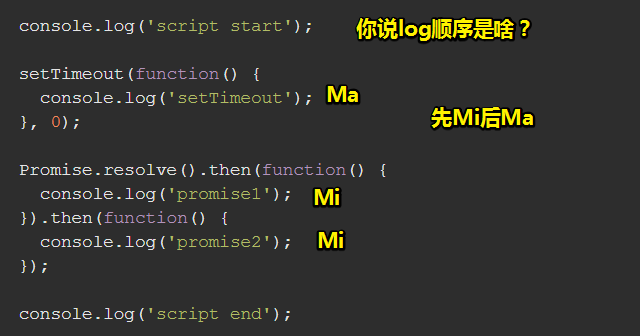
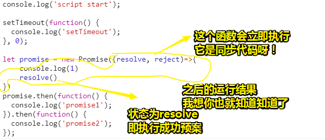
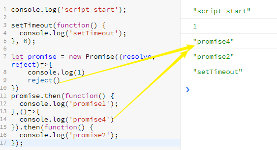
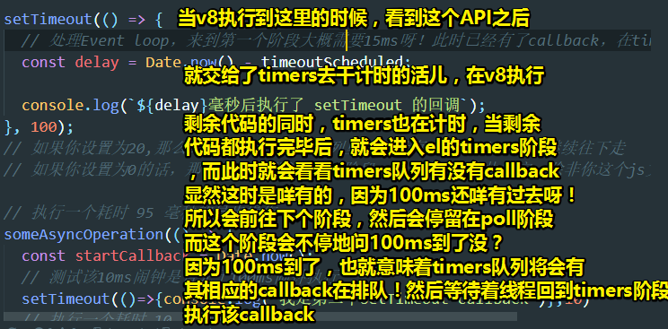
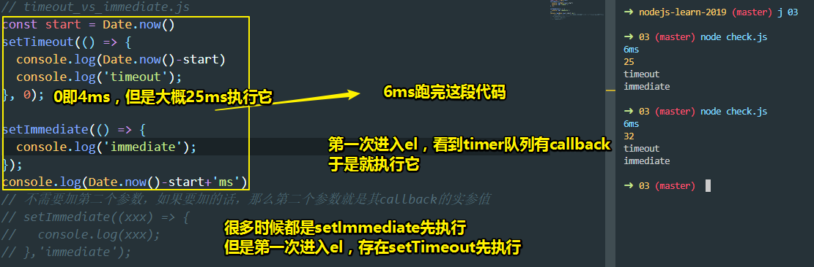
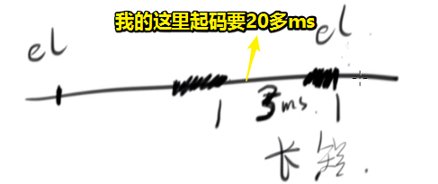
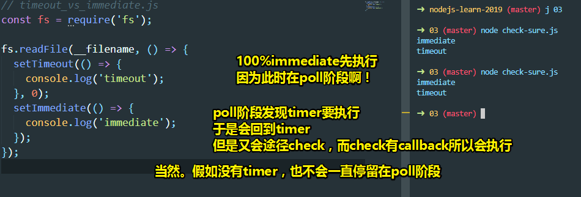
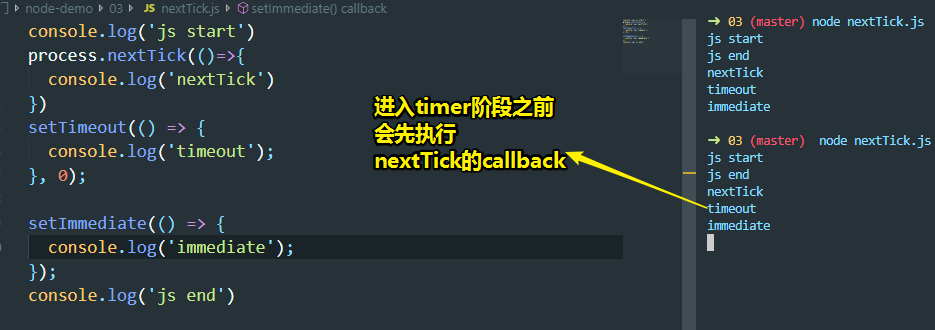

# Event Loop

很多前端面试官根本就不知道什么是Event Loop，但是就是喜欢瞎问！既然你们问了，那芳芳就告诉一个标准答案给你们！

以前芳芳对event loop只是大概了解一下，而自从大概翻译了一下[官方文档](https://nodejs.org/de/docs/guides/event-loop-timers-and-nexttick/)之后（*晚上11点到深夜3点，4个小时*），就知道什么是event loop了。

> 芳芳的学习方式：你既然一定要让我学会，那我就花一晚上把相关文档全部看一遍，英文文档看不懂的话，那就翻译一遍，翻译完之后那就懂了！这就是芳芳的学习方式！

## ★什么是Event Loop？

### ◇概述

话说，什么是Event Loop呢？这跟前端有关系吗？——其实一毛钱关系也没有！因为它是后端的知识呀！而且这是nodejs后端的知识！

那么为啥面试官现在总喜欢问呢？——因为总得有一点「面试官觉得自己会而你不会」的知识点，然后就问你啦！而Event Loop就是它道听途说了几篇文章，然后觉得自己会了，然后就问你了，目的就是看你有没有看这几篇文章！

然而大部分文章，芳芳看了都是错的！甚至阮一峰写的都是错的！

很多人都不知道Event Loop是什么，但是其实官方文档已经讲得很清楚了，你稍微看一下官方给出的例子代码，都能搞清楚Event Loop到底是什么鬼东西了！

**在理解什么是Event Loop之前，先来说说什么是Nodejs？**

### ◇什么是Nodejs？


话说，nodejs和JavaScript是什么关系？

没啥关系，因为它是跟Chrome一个级别的呀！

为啥这样说呢？

官方文档说「nodejs是一个可以运行JavaScript的这么一个平台」

既然如此，那么未来的哪一天，nodejs会不会支持某门语言呢？

按照我们的说法，显然，这是可以的，nodejs并不一定要支持JavaScript，只是一开始就选择支持JavaScript罢了！

同理，Chrome也是一个可以运行JavaScript的这么一个平台

当然，除此之外，Chrome还有其它功能，比如：

- 渲染模块：把页面渲染成屏幕上可见的东西，主要是渲染HTML和CSS（这个渲染引擎比JavaScript引擎复杂了不知道多少倍）
- 网络模块：它的作用，比如说，我们输入一个网址，然后回车，你说发起的这个请求是谁干的？难道是JavaScript干的？——不是JS请求的，而是C++的一些库来请求的！所以说这跟JS没啥关系！
- JS引擎：它是干嘛的呢？——负责执行JavaScript代码的呀！可见，我们觉得很重要的JavaScript，占不到Chrome的三分之一功能，总之JS只是个很小很小的这么一个模块！
- UI模块
- 扩展模块（插件模块）
- ……

同样同理，nodejs也是这样的，它有以下这些模块：

- 文件模块（fs）
- HTTP模块
- ……

那么，我们怎样去使用这些模块呢？——nodejs给了你一个JS引擎呀！

这个JS引擎可以执行JavaScript代码，然后你还可以用JavaScript代码去调用诸如文件、HTTP等这些模块！

所以说，JS引擎的功能其实是很少的！可见，这就是JS引擎大概要干的事……

一般来说，JS引擎用的是V8引擎，nodejs用的是v8引擎，Chrome用的也是v8引擎，而Chrome的其它模块用的不是V8引擎的内容，那么用的是什么呢？——用的是一个叫做chromium的这么一个东西，即一个开源的渲染引擎！而Chrome则是一个在chromium的基础上然后包装了一些东西而存在的这么一个东西！这就是我们的JS引擎在nodejs和Chrome中所占的位置了！

> 浏览器的内核中主要分为渲染引擎和 javascript 引擎，而Chrome的浏览器内核是chromium，不过之后chrome的v8引擎从内核中独立开来的，即chromium主要表示的是渲染引擎了！

**➹：**[chrome浏览器页面渲染工作原理浅析 - 知乎](https://zhuanlan.zhihu.com/p/30134423)

**➹：**[浏览器渲染引擎 - 掘金](https://juejin.im/post/5ac45882518825558723c4fd)

**➹：**[主流浏览器内核介绍（前端开发值得了解的浏览器内核历史） - 前端 - 掘金](https://juejin.im/entry/57ff3cea0e3dd90057e5f25e)

**➹：**[认识 V8 引擎 - 知乎](https://zhuanlan.zhihu.com/p/27628685)

> 在nodejs下，写JavaScript代码的时候，很多时候我们需要require某个内置模块，或者一些第三方提供的包，就拿内置模块来说，使用的还是JavaScript代码，但是这些代码却具有可以让我们读取文件、启动http server等这样的能力，我们之前在浏览器跑的JavaScript的代码并不具备这样的能力，但是nodejs的存在却让我们看到了JavaScript这门语言在不同平台下，所具备的能力是不同的！你JavaScript在chrome这个平台下可以操作DOM，但不能读取文件等；你JavaScript在nodejs这个平台下可以读取文件等，但不能操作DOM，当然，下边这个库似乎可以让在nodejs环境运行的JavaScript具备操作的DOM的能力：
>
> **➹：**[cheerio - 为服务器特别定制的，快速、灵活、实施的jQuery核心实现](https://cheerio.js.org/)
>
> **➹：**[通读cheerio API - CNode技术社区](https://cnodejs.org/topic/5203a71844e76d216a727d2e)
>
> **➹：**[使用node.js cheerio抓取网页数据 - 奇舞团博客](https://75team.com/post/%E4%BD%BF%E7%94%A8node-js-cheerio%E6%8A%93%E5%8F%96%E7%BD%91%E9%A1%B5%E6%95%B0%E6%8D%AE.html)
>
> 或许我应该把编程语言脱离某个平台来看，因为这样一来，我学习编程语言的目的就是，找出所有编程语言的共性，然后去学习它，比如简单的赋值的？简单的循环怎么写？简单的判断怎么写？等等，学会这些之后，在让自己陷入某个平台去学其它诸如Java这样的语言，至此，对赋值、循环等代码书写姿势也就好理解得多了。像是之前我学习Java web的时候，简单用tomcat搞个http server，都得配置不知所云的东东，而用nodejs之后，就很快明白，http server到底是什么了！反正，很多时候我只想快速的拿到这个结果，然后去理解这个过程！而不是像tomcat那样需要配置这样那样的东西，然后再拿到这样的结果。不管如何，你理解这个东西，总得有个整体认识才能更好地去理解这个东西。
>
> **知识零碎，需看整再深入……而看整，需做项目**
>
> **➹：**[如何开始学习计算机编程 - OSCHINA](https://www.oschina.net/translate/how-to-start-programming-for-free)
>
> **➹：**[编程语言入门的共性 - 知乎](https://zhuanlan.zhihu.com/p/28965128)
>
> **➹：**[为什么计算机专业好多年了，就是学不会编程？ - 知乎](https://www.zhihu.com/question/57615231)

### ◇JS 引擎


JS引擎是啥？——它是个单线程呀！

那么单线程又是什么呢？——简单来说就是**同一时间只能做一件事**（one thing at a time）

与之相对的多线程，其实也是同一时间只能做一件事，只是线程切换了而已，然后这样就看起来就是多个线程协同合作了。关于这些硬核知识，你可以去看看「[深入理解操作系统](https://book.douban.com/subject/1230413/)」这本书

> 宏观上的多线程，微观上的单线程

总之，你可以这样简单理解：

- 单线程：同一时间只做一件事
- 多线程：同一时间可以做多件事情

假如我们的JavaScript引擎执行JavaScript代码是单线程的，那么我们会遇到一个很大的问题，比如有这样一份代码：

```js
var a = 1; //这条语句就表示做了一件事情
get('/1.json') //用JavaScript代码来请求一个网络模块(发送ajax请求)，假设耗时1000ms,即1秒
```

第一行代码，JS引擎很快就做完这件事了

接下来，来到第二行代码，假设在执行第二代码的1000ms之内，有吃瓜群众用户，点击了页面里边的某个按钮（用于在控制台打印一个1，即`console.log(1)`），请问JS引擎能对用户的点击做出响应吗？即JS在能在执行第二行代码的同时，即在1s之内，打印一个1吗？

显然是没有的呀！因为此时的JS引擎被第二行代码占用了呀！

那么如何做到在请求的同时，还可以响应用户的交互（如点击）呢？

很简单，请人帮忙呀！

那么这又是如何请的呢？——叫一个哥们（浏览器的网络模块，C++写的）来请

当我们要执行第二行代码，即要get一个资源的时候，不需要JS引擎自己做，而是告诉网络模块这哥们说「C++哥们，帮我请求一个资源呗！」

于是，这1000ms的耗时，其实是让另外一个家伙做的（**让JS引擎省了1s的功夫，好让JS引擎自己继续执行剩余的代码**），而JS引擎则是让它去请求而已！请求完之后，这个网络模块会通知JS引擎执行（如执行一个callback）！

可见，JS引擎虽然是单线程的，但是会有很多哥们兄弟帮它做事，还记得这个setTimeout这个API吗？它可不是JavaScript的API，而是浏览器的API，简单来说，这类API的特点就是JavaScript自己不实现，由浏览器自己实现！

假设我们要1s钟之后做一件事，即 `setTimeout(callback,1000)`，那么当JS引擎执行了这代码会做什么事呢？

它会通知计时器模块，为了好表述，简称为通知chrome，让chrome来帮我们计时，那么它是如何计时的呢？不停地看到1s了没？到1s之后，就会通知JS引擎说「你该去执行callback了」

> 其实这个过程会把callback扔到任务队列里去排队，当call stack为空的时候，就会执行排头的那个callback，而此时JS引擎才会真正地执行callback

可见，JS引擎是个很喜欢偷懒的家伙，基本上啥事情都不做，就是不停地调浏览器API，来让其它的模块做事！而这些模块跟JS引擎完全没关系，若说有点关系的话，那就是开发者有用到浏览器API的时候，就会请这些模块帮一下忙罢了！

至此，我们可以看到，JS引擎是如何实现同时做多件事情的呢？

我们知道，JavaScript是一门同一时间只能做一件事的语言！然而，它却可以同一时间做多件事，那么这是为什么呢？——因为它有兄弟帮它做啊！即有其它线程帮它做，如c++写的网络模块这么一个线程，它就不是JS的线程！

> 我们的JavaScript代码要做诸如DOM、ajax、setTimeout等这样的操作，实际上这代码的背后，我们有用到除了JS引擎以外的其它线程，在我看来，这个过程是隐式的，不想Java那样有个Thread类，可以自己用Java代码创建线程（显示姿势）

### ◇Event Loop

回到 nodejs 的 Event Loop。注意，这是nodejs的event loop，可不是chrome的event loop（比较简单，一般不会讲解）

nodejs的event loop就是用于实现JavaScript能去做异步的事情，但是这不是同时做多件事情，而是请操作系统去做这些事情，至此，nodejs下的JavaScript同样具备所谓的同时做多件事情的能力！

#### 概述

我们知道JavaScript 是单线程的，但是有了 event loop 的加持，Node.js 才可以非阻塞地执行 I/O 操作，把这些操作尽量转移给操作系统来执行。

我们知道大部分现代操作系统（内核，kernels）都是多线程的**，这些操作系统可以在后台执行多个操作**。当某个操作结束了，操作系统（内核）就会通知 Node.js，然后 Node.js 就（可能）会把对应的回调函数添加到 poll（轮询）队列，最终这些回调函数会被执行。

#### 详解Event Loop


> 操作系统是怎么让我们的回调函数执行的？——肯定是发个消息说「文件读完了」，可是文件读完之后，谁来处理「文件读完了」这个信息呢？那就是Event Loop啦！
>
> 可以把操作系统看做是个对象，nodejs这个平台也是一个对象，event loop也是个对象，而面向对象的核心就是对象与对象之间交互，然后对象和对象可以直接通过消息传递来工作。
>
> 所以：
>
> 1. nodejs把「读取某个xx文件」的消息交给操作系统对象来做
> 2. 操作系统对象把「文件读完了」这个消息交给Event Loop这个对象处理，处理好之后，就会把「callback」这个消息交给nodejs平台下的v8引擎对象去处理。

当 Node.js 启动时，会做这几件事

1. 初始化 event loop
2. 开始执行脚本（或者进入 REPL，本文不涉及 REPL）。这些脚本有可能会调用一些异步 API、设定计时器或者调用 process.nextTick()
3. 开始处理 event loop

那么如何处理 event loop 呢？下图给出了一个简单的概览：

```
   ┌───────────────────────────┐
┌─>│           timers          │
│  └─────────────┬─────────────┘
│  ┌─────────────┴─────────────┐
│  │     pending callbacks     │
│  └─────────────┬─────────────┘
│  ┌─────────────┴─────────────┐
│  │       idle, prepare       │
│  └─────────────┬─────────────┘      ┌───────────────┐
│  ┌─────────────┴─────────────┐      │   incoming:   │
│  │           poll            │<─────┤  connections, │
│  └─────────────┬─────────────┘      │   data, etc.  │
│  ┌─────────────┴─────────────┐      └───────────────┘
│  │           check           │
│  └─────────────┬─────────────┘
│  ┌─────────────┴─────────────┐
└──┤      close callbacks      │
   └───────────────────────────┘
```

注意：每个方框都是 event loop 中的一个阶段。

> 把这个图看做是这样：
>
> 
>
> chrome里边的event loop就是抽象成这样的：
>
> 

#### 各阶段概览

- timers 阶段：这个阶段执行 setTimeout 和 setInterval 的回调函数。

- I/O callbacks 阶段：不在 timers 阶段、close callbacks 阶段和 check 阶段这三个阶段执行的回调，都由此阶段负责，这几乎包含了所有回调函数。

- idle, prepare 阶段（译注：看起来是两个阶段，不过这不重要）：event loop 内部使用的阶段（译注：我们不用关心这个阶段）

- poll 阶段：获取新的 I/O 事件。在某些场景下 Node.js 会阻塞在这个阶段。

- check 阶段：执行 setImmediate() 的回调函数。

- close callbacks 阶段：执行关闭事件的回调函数，如 socket.on('close', fn) 里的 fn。

> 看起来是6个阶段，其实是7个阶段，毕竟还有idle(空闲阶段)，prepare（准备阶段），不过我们可以直接把它们俩统一看作为event loop 内部使用的阶段。即把它们俩打包了一层！

**一个 Node.js 程序结束时，Node.js 会检查 event loop 是否在等待异步 I/O （asynchronous I/O ）操作结束，是否在等待计时器（ timers ）触发，如果没有，就会关掉 event loop。**

#### 我们关注的阶段

只需要关注timers阶段、poll阶段（最重要的）以及check阶段。


详解：[②](#er)

**①timers 阶段和poll阶段**

看了下边这个代码，你就知道这两个阶段做了什么了：

```js
const fs = require('fs');

function someAsyncOperation(callback) {
  // 假设读取这个文件一共花费 95 毫秒
  fs.readFile('/path/to/file', callback);
}

const timeoutScheduled = Date.now();

setTimeout(() => {
  const delay = Date.now() - timeoutScheduled;

  console.log(`${delay}毫秒后执行了 setTimeout 的回调`);
}, 100);


// 执行一个耗时 95 毫秒的异步操作
someAsyncOperation(() => {
  const startCallback = Date.now();

  // 执行一个耗时 10 毫秒的同步操作
  while (Date.now() - startCallback < 10) {
    // 什么也不做
  }
});

```

解释：


> 难道这仅仅只是告诉我setTimeout里边的callback执行，可以超时执行！

我在想，假如刚好到了100ms，而此时操作系统刚好通知了poll，即push了一个callback进来，那么会先执行这个callback，还是回到timers阶段执行setTimeout里的callback呢？

或者说假如poll里边的poll队列还有callback呢？于是做了追加了一次I/O操作：


> log了那么多次？这是个循环呀！只要小于10ms就会log，可是第一个I/O操作为啥不log呢？
>
> 你把它的10改为20就有了，可能log这个操作耗费了10ms，所以值看到了打印一次，而之后的log可能会有缓存之类的性能优化，导致log时间贼短。毕竟我们的log内容只改了一个「二」

总之：

poll阶段有两个主要功能，为了好记忆，直接限定死说它有两个功能：

- 计算I/O的阻塞时间，然后处理poll队列里边的事件回调
- 检查timer阶段里的计时器是否到点了，如果到点了，就绕回去执行它的callback

当 event loop 进入 poll 阶段，且此时timer阶段的计时器还没有到点（**如果先到点了，那就先回去执行timer阶段里的计时器，不要想着「到点了，同时该阶段的poll 队列里边突然出现callback了」这种极端情况，因为微观上看总是会有先后的，或者会有轮询机制检查timers阶段，如2ms去检查计时器到点没？而这个2ms的间隙或许poll 队列来了callback，就会先去执行该poll队列里的callback了。等callback执行完，就会回到timers阶段执行计时器的callback。所以说这冲突是不存在的！**），那么就会发生以下两件事中的一件：

1. 如果 poll 队列**不是空的**，event loop 就会依次执行队列里的回调函数，直到队列被清空或者到达 poll 阶段的时间上限。
2. 如果 poll 队列是空的，就会： 
   1. 如果有 setImmediate() 任务，event loop 就结束 poll 阶段去往 check 阶段。
   2. 如果没有 setImmediate() 任务，event loop 就会等待新的回调函数进入 poll 队列，并立即执行它。

一旦轮询队列（**poll** queue）为空，事件循环将检查 timers（计时器） 的时间阈值（*thresholds* ，临界值）是否已达到。如果一个或多个timers（计时器） 就绪，事件循环将回滚到**timers**阶段，以执行这些计时器的回调。

> 我在想这个文件读取真的是95ms吗？因为我把setTimeout的延时设置了为20也行，只有0（4ms）是可以先执行它的。而且读取文件的路径乱写，也不会报错，毕竟我们的callback是自己写的，不是默认的 `(err,data)=>{}`
>
> 当我设置为0ms的延时之后，大概会在12ms之后执行这个callback。或许并没有所谓的优先级，只要某个阶段里的任务队列里边有callback，就会去依次执行，直到队列为空后，再去下一个阶段！

**➹：**[Event Loop、计时器、nextTick - 掘金](https://juejin.im/post/5ab7677f6fb9a028d56711d0#heading-12)

**➹：**[深入解析node事件环原理 - 掘金](https://juejin.im/post/5b0ac7b151882538a2403f42#heading-0)

**➹：**[The Node.js Event Loop, Timers, and process.nextTick() - Node.js](https://nodejs.org/en/docs/guides/event-loop-timers-and-nexttick/)

## ★MacroTask v.s. MicroTask

接下来，来讲讲这两个家伙，这两个家伙读音差不多！

为了更好地记忆这两个任务，我们把它们分别叫做Ma任务和Mi任务，组合在一起就是MaMi，妈咪！

回过头来说它们俩，一个叫宏任务，一个叫微任务

它们俩有啥区别呢？之前我们讲el时，并咩有涉及它们俩，因为这两个东西跟el没啥关系呀！

既然没有关系，那么它们是哪来的概念呢？——来自于ES5规范呀！

这个规范里说到有些任务是Ma任务，有些则是Mi任务

那么我们之前讲到的el又是什么呢？它不是ES规范里写的东西，它是nodejs里边使用c语言所写的代码呀！

那么MaMi任务与el真得没有关系吗？

要说没有关系的话，肯定是假的，关系是有，但不大！比如说MaMi这两个东西肯定是通过el来实现的！而实现的区别就是大家是用哪个API来实现的！

先来说说Ma任务：

有哪些API是属于Ma任务的呢？

- `script`（全局任务，全局函数中的同步任务）、setTimeout、setInterval、 setImmediate、 I/O、 UI渲染

假设我们有这样一份代码：

```js
console.log(1)
setTimeout(callback,0) //简称为timer
```

你说setTimeout里的callback会放到哪里执行呢？

显然是放到Ma任务队列里边

假如这个callback里边也有个timer，那么timer一到点，同样，会把其中的callback放到Ma任务队列里边去！

假如这个callback里边有个`process.nextTick(callback1)`，那么该callback1就会被放到Mi任务队列里边去！

> 视屏里说同步任务也放到Ma任务里边执行，但我目前认为不是这样的！因为callback的执行，肯定是通过el去把代码push到v8 的call stack执行呀！
>
> 而MaMi任务队列里边存放的显然是一个个callback对吧！而不是一个无厘头的语句！
>
> 视屏里说到先执行宏任务，然后再执行微任务，如果宏任务是可以存储同步代码的，那么显然宏任务必然是先执行的，但是这样的解释就有点无厘头了。当然，这种「理解」会比较快速理解哪个callback先执行！
>
> 确实是先执行宏任务，因为有个全局任务！

除了nextTick属于微任务以外，promise也属于Mi任务，而且这是最容易被问到的！

直接看一道题目：

> **➹：**[Tasks, microtasks, queues and schedules - JakeArchibald.com](https://jakearchibald.com/2015/tasks-microtasks-queues-and-schedules/)



注意：当同步任务执行完毕后，就会先去看Mi任务里的东西，如第一个`Promise.then()`，然后根据它可以知道我们应该把那个callback（成功预案还是失败预案） push到JS的call stack里执行，然后，该call stack里的callback结果返回了一个undefined，然后发现还有一个then，于是又push了一个`Promise.then()`到Mi任务里边去，然后就是清空这个callstack了，然后原先第一次进入Mi任务里的`Promise.then()`就会被移除掉，后来的 `Promise.then()`取代了它的位置。

既然Mi任务里边还有 `Promise.then`（知道把那个预案push到callstack里执行，因为有状态变化呀！），那就执行它的callback呗！该callback执行完后，callstack清空，Mi任务清空，目前只剩下在Ma任务的timer了，假如此刻有**Render task**的话，那么会优先执行它的任务，执行完毕后，才会去执行Ma任务里的timer。

> 此刻理解的task优先级：Mi>Render>Ma。
>
> 关于Render task，用于更新UI渲染，然而「更新UI渲染」会根据浏览器的逻辑，决定要不要马上执行更新。毕竟更新 `UI` 成本大，所以，一般都会比较长的时间间隔，执行一次更新，最优的选择是16.6ms！所以这一步可能会错过，然后直接执行Ma里的任务！
>
> 还有不要把callback写得简洁点，不要写那么多代码！
>
> **➹：**[浏览器渲染过程及JS引擎浅析 – Clloz-素直になれない](https://www.clloz.com/programming/front-end/js/2019/04/25/how-browser-work/#i-10)

改一下题目：



> 

解析：

1. 先执行Ma任务（主任务，Run script，它的生命周期——等到所有Mi任务都执行完毕后，它才会从Ma任务队列里边被移除掉），即当前js文件的所有同步代码，而这其中添加了一个Ma任务（`timer`），一个Mi任务（`promise.then`）
2. 执行Mi任务，然而执行Mi任务的callback过程又产生了一个Mi任务，于是又继续执行Mi任务，直到没有Mi任务，才会进入下一轮（粗暴理解就是把Promise里的then里的callback依次添加到Mi任务，当然这种粗暴不合理啊！因为你无法确定第一个then的callback执行完毕后，然后第二个then会选择哪个callback执行哈！）
3. 更新UI渲染（有可能会跳过，这得看浏览器！目前我认为这是不可控因素！）
4. 回到Ma任务，清掉主任务，然后执行timer这个任务
5. GG

好了，目前为止，你应该明白这log顺序是如何来的吧！

## ★总结

- chrome有它的event loop，nodejs也有它的event loop
- 关于MaMi任务的解释，最好的是nodejs下的JavaScript。因为有些API，浏览器是没有的，比如setImmediate、process.nextTick……

## ★Q&A

### ①libuv？

Node.js 用来实现 event loop 和所有异步行为的 C 语言写成的库


这个库的作用：

**为了防止 poll 阶段占用了 event loop 的所有时间，libuv对 poll 阶段的最长停留时间做出了限制，具体时间因操作系统而异。**

### <a id="er">②三个阶段的讲解？</a>

面试一般都是只考这三个阶段

每个阶段都会有一个对列，如timers阶段的就是timers队列，同理还有poll 队列、check队列等

这些队列里边存放的是callback，即一个函数引用。那timers队列来说，你写了个 `setTimeout(callback，10)`

那么就会把这个`callback`塞到timers队列里边去，同时会记下来这个函数什么时候应该被调用！到了调用时间就会被调用！没有到调用时间就会进入下一个阶段！

然后一般会停留在poll这个阶段。

poll这个阶段会干啥事情呢？——什么都干，只是不干timers和check要干的事情！比如操作系统说「文件读完了」，这个信息就是在el的poll阶段被接收！所以说poll阶段也叫轮询阶段，经常对操作系统说「操作系统老哥，你搞完了吗？你搞完了吗？」

如果操作说「搞完了」，那么这个信息就会被放在poll队列中的第一位！

然后poll就会处理这个「文件读完了」这个信息，然后把其中的数据给拿出来，然后把该数据放到对应的回调里边，即call一下这个函数！

总之，**poll阶段主要用来处理所有的跟操作系统，比如说文件、网络请求等这样的操作！除了特别几个异步API以外，都不需要这个阶段去搞，**简单来说，就是有关这些操作的callback都是在这个阶段处理的，像是setTimeout、setInterval等API里边的callback则是交给timers阶段处理的！

那么check 阶段又是处理什么的呢？它只处理一个API——setImmediate

这个函数我们并没有在浏览器环境下的JavaScript里边看见过，它是一个特殊的计时器

一般在面试的时候都会问「setTimeout和setImmediate哪个快？」——显然后者快！

小结：

1. timer阶段：专门处理setTimeout和setInterval的callback调用
2. poll阶段：处理所有的
3. check阶段：专门处理setImmediate的callback调用！

> 之前了解到chrome的el，有宏任务和微任务，这两个任务都有一个队列，而且微任务的队列里的callback优先级要比宏任务里的高！即当微任务里的callback执行完毕后，才会执行宏任务里的callback！如果在执行宏任务里的callback过程中产生了微任务，那么一旦微任务里边出现callback，就会优先去执行这里边的callback，无须等待宏任务里边的callback是否还有剩余！换句话说就是，每次执行完一个callback都会去检查微任务里边有没有callback，没有的话，就去检查宏任务的……
>
> 这两个任务的相关API：
>
> ```js
> macrotasks: setTimeout, setInterval, setImmediate, I/O, UI rendering
> microtasks: process.nextTick, Promises, Object.observe(废弃), MutationObserver
> ```
>
> 浏览器关注的微任务无非就是`Promise.then(s1,e1)`里的s1或e1这样的callback，像是setImmediate，浏览器是咩有实现这个API的！

用法：

el会依次进入6个阶段，其中会在poll阶段一直停留着，用于看看文件是否读完了，读完了之后就会调用callback

详解这几个阶段：

1. timers：依次看timers队列里的callback是否到时间 了，如果到时间了就执行，没到时间就会往下走！

2.  pending callbacks ：来到这个阶段，就会做这个阶段要做的事情，不会停留

3.  idle, prepare：同上

4. poll：会停留在这个阶段，这个阶段会做啥事情呢？会做两件事：

   

   1. 会重复检查刚才的计时器是否到时间了（我觉得应该是检查timers队列有没有callback的存在，即队列里边是否有任务），如我们之前写了两个闹钟，一个4ms，一个100ms，第一个进入el，显然4ms已经就到了，那么timersd对列里边就会有它的callback，然后就会执行这个4ms的callback，然后就把该callback从timers队列里边清除，而100ms的callback显然还咩有在timers队列里边，而此时该timers队列为空，而且不会等待100ms这个callback，而是继续往下个阶段进行，直到停留在poll阶段，该轮询阶段会不停地看100ms到了没，相当于不停地看表，然后发现在100ms到了之后，就会马上进入到timer阶段，而timer阶段一看「咦！你是100ms进来这个阶段的」，然后正好看到有个100ms的回调，于是就把这个回调给执行了！

      > 芳芳的解释是，按照4ms、100ms这样先把callback push到timers队列里边去，就像这样：
      >
      > 
      >
      > 可是问题来了，假设我们读取文件的callback，同样使用setTimeout，而且这个闹钟假如是小于100ms就执行的，那么它的callback会先于100ms的callback执行吗？按照上图的说法，显然会先把它扔到timers队列的末尾去吧！于是我测试了一下，结果发现哪个闹钟先到规定的时间，就会把它的callback扔到timers队列里边去，而不是一开始就把callback扔到timers队列里边去。至于poll阶段应该是不停地检查timers阶段的timers队列是否有callback存在！如果有，就得兜一圈回去执行它！直到该timers队列空空如也，才会继续往下个阶段前进！
      >
      > 自己的另一种理解姿势：
      >
      > 

   2. 轮询阶段的空闲时间（在等待4ms到100ms的那个表的过程中）在干嘛呢？如果在空闲时间这段期间，有个消息进来了，比如操作系统说「文件读完了」，而这个时候我们定义的100ms的那个表走到了90ms。那么这时候的poll是等到100ms，然后去执行那个100ms的callback，还是直接执行这个90ms进来的callback呢？——显然是直接去执行这个文件读完的callback，即call一下这个callback

      然而，这个callback的执行可能会占用很长时间，如20ms

      那么这会怎样呢？

      由于JavaScript是单线程的，即此时的call stack不是清空状态，所以就会错过这个100ms的时间，当20ms过去之后，即call stack为空之后，就会再次进入（110ms进入）到timer阶段执行100ms的那个callback，而此时这个callback早已超时了90+20-100=10ms

      所以说「你虽然设置了100ms执行callback，但是有可能由于100ms的时候，有个操作系统的事件进来了，那么poll轮询只好去执行这个刚刚进入到poll队列的callback，由于刚好错过了这个100ms时间点，所以只能超时执行timer里边的那个100ms的那个callback了」

      总之，你说100ms执行timer里的callback，但是有可能不是100ms，因为存在正好那个时间有事情要做！那么那就只能等那个事情做完之后，再次进入timer阶段。

   代码演示：

   ```js
   const fs = require('fs');
   
   function someAsyncOperation(callback) {
     // 假设读取这个文件一共花费 95 毫秒
     fs.readFile('/path/to/file', callback);
   }
   
   const timeoutScheduled = Date.now();
   
   setTimeout(() => {
     const delay = Date.now() - timeoutScheduled;
   
     console.log(`${delay}毫秒后执行了 setTimeout 的回调`);
   }, 100);
   
   
   // 执行一个耗时 95 毫秒的异步操作
   someAsyncOperation(() => {
     const startCallback = Date.now();
   
     // 执行一个耗时 10 毫秒的同步操作
     while (Date.now() - startCallback < 10) {
       // 什么也不做
     }
   });
   ```

   直接在脑子里边看代码运行一遍，猜测结果。当然，你可以用图分析：

   

5. check阶段：不知你有咩有发现，每次由poll到timer的过程都会经过check，所以这就是**setImmediate总是要比setTimeout先执行**的原因所在。毕竟我们要先去执行setImmediate的callback哈！

   代码示例：

   

   > 如果 setTimeout 和 setImmediate 都是在主模块（main module）中被调用的，那么回调的执行顺序取决于当前进程的性能，这个性能受其他应用程序进程的影响。（不可控因素）

   所以说这两个回调的执行顺序是无法判断的，即便上边的例子看起来像是setImmediate总比setTimeout先执行！用图来解释一下：

   

   > 我们无法预料脚本结束到进入el这段时间是多少，可是即便可以预料，但是我们在执行脚本的时候，遇到setTimeout这个API时，其实就已经在计时了，如果剩余的脚本代码执行只要了2ms，而进入el只要了1ms，那么第一次经历timer阶段，显然timer 队列里边是咩有callback的！

   如果脚本执行结束，到进入el的一瞬间如果是小于4ms的话，那么就是setImmediate先执行了。

   

   需要注意的是，不同el实现可能不一样哦！如chrome的el实现！

   总之大部分情况下都是setImmediate先执行！除了第一个进入timer的时候。

   如果我想100%确保setImmediate先执行呢？那这该如何做呢？

   如果你把上面代码放到 I/O 操作的回调里，那么setImmediate 的回调就总是优先于 setTimeout 的回调：

   

   > 我们无法预测某个callback到底是多少ms之后就执行的，我们只能确定哪个callback先执行，哪个callback后执行。

6. nextTick()

   这个名字我们在vue里边见过！但是浏览器没有这个API。

   它不属于el里边6个阶段中的任何一个，类似于超脱五行之外。简单来说，它就不是el的一部分！

   不管 event loop 当前处于哪个阶段，nextTick 队列都是在当前阶段后就被执行了。

   总之，不管哪个阶段都会去先执行nextTick。这是为什么呢？因为API就是这样设计的，没有为什么！

   理论上来说，nextTick会先于所有的回调执行！

   

   可见，进入el之前就会执行它！不管你是把nextTick这份代码放到整个js文件的最后边，还是最前边，都会如此！

   总之，nextTick永远先于immediate和setTimeout，而immediate和setTimeout，一般来说是immediate先，只有一种情况下setTimeout先，那就是第一个启动el，而且有点慢的情况下就会先执行setTimeout。反之，如果启动很快且js文件的执行很短，那么setTimeout总是会比immediate后执行。

### ③typescript能在node环境下运行吗？

> 换言之，你在node环境下，使用typescript进行开发吗？

可以的！

**➹：**[使用typescript开发node js - 简书](https://www.jianshu.com/p/0e37a793ac3a)

### ④这就是为什么...的原因？病句？

> 本来先想写「这就是为什么setImmediate总是要比setTimeout先执行的原因」

是病句,“这就是”是一个陈诉因的助词,而最后“的原因”也是,重复了.就好像,“我为什么之所以”一样,重复了~!

**➹：**[困惑很久的一个问题!这句话“这就是为什么...的原因”是病句吗?“这就是为什么.._作业帮](https://www.zybang.com/question/23e600451d9b3e89fe8cf0672278490c.html)

### ⑤nextTick的妙用？

没有nextTick之前：

```js
let bar;

// 这是一个异步 API，但是却同步地调用了 callback
function someAsyncApiCall(callback) { callback(); }

//`someAsyncApiCall` 在执行过程中就调用了回调
someAsyncApiCall(() => {
  // 此时 bar 还没有被赋值为 1
  console.log('bar', bar); // undefined
});

bar = 1;

```

有nextTick之后：（这就是nextTick为啥被设计出来的原因！）

```js
let bar;

function someAsyncApiCall(callback) {
  process.nextTick(callback);
}

someAsyncApiCall(() => {
  console.log('bar', bar); // 1
});

bar = 1;

```

你可以看到我们通过nextTick把someAsyncApiCall变成 了一个伪异步。

毕竟其中的callback是在js文件执行完毕后再去调用的！


